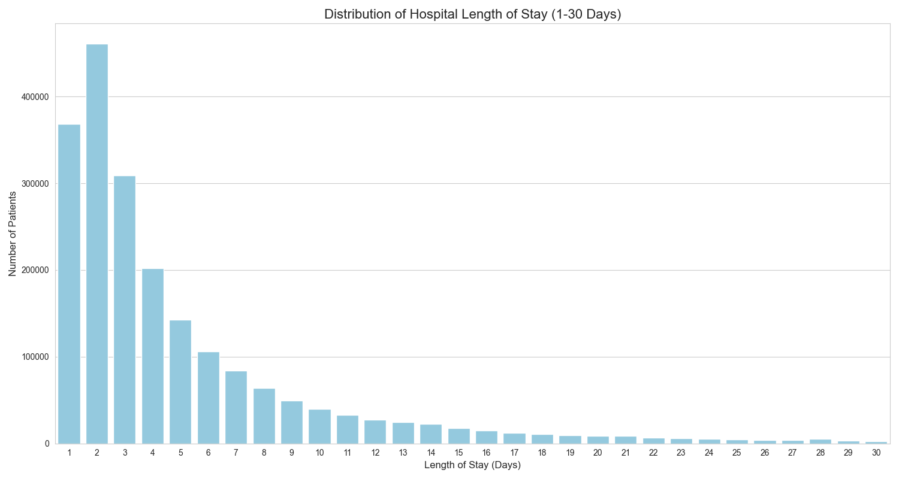

# End-to-End Analysis of NY Hospital Inpatient Discharges (2021)

---

## 📌 Project Overview

This project provides a comprehensive analysis of the New York Statewide Planning and Research Cooperative System (SPARCS) dataset, focusing on over **2.1 million de-identified inpatient discharges** for the year 2021. The goal was to perform an **end-to-end data analysis project**, starting from raw data cleaning and preparation to building a **fully interactive business intelligence dashboard** that uncovers key insights into hospital operations, clinical outcomes, and financial performance.

---

## 🔍 Key Findings & Insights

### 📈 Operational Insights

* **Newborn deliveries** and **Sepsis cases** are the primary drivers of patient volume.
* The **average length of stay** across all facilities is approximately **5.6 days**.

### 💰 Financial Performance

* A **strong positive correlation** exists between the patient's **severity of illness** and **average charge per discharge**.
* Cases with 'Extreme' severity have significantly higher charges than 'Minor' cases.

### 🧬 Clinical Analysis

* **Emergency admissions** constitute approximately **65%** of all cases.
* Patient demographics reveal a diverse distribution across **age**, **gender**, and **race**.

### 🏥 System Comparison

* Significant variation in average charges between hospital systems reveals potential differences in **cost structure** or **case mix intensity**.

---

## 🔄 Data Analysis Lifecycle

### 1. 📊 Business Understanding & KPI Definition

**Primary Objectives:**

* Identify key cost drivers and operational inefficiencies.
* Enable hospital systems to benchmark and optimize care.

**Key Performance Indicators (KPIs):**

* Total Patient Discharges
* Average Length of Stay (ALOS)
* Average & Total Patient Charges/Costs
* Emergency Admission Rate
* Diagnosis, Severity, and Payer Mix Distributions

---

### 2. 📥 Data Acquisition & Setup

* Raw dataset size: **800MB+**, with **2.1M+ records**.
* Challenge: Too large for in-memory processing.

**Solution:**

* Set up a **PostgreSQL** database to host and query the dataset efficiently.

```sql
CREATE TABLE inpatient_discharges (
    "Hospital Service Area" TEXT,
    "Hospital County" TEXT,
    "Operating Certificate Number" BIGINT,
    "Permanent Facility Id" BIGINT,
    "Facility Name" TEXT,
    "Age Group" VARCHAR(50),
    "Zip Code - 3 digits" VARCHAR(10),
    "Gender" VARCHAR(20),
    "Race" VARCHAR(50),
    "Ethnicity" VARCHAR(50),
    "Length of Stay" TEXT,
    "Type of Admission" TEXT,
    "Patient Disposition" TEXT,
    "Discharge Year" INTEGER,
    "CCSR Diagnosis Code" TEXT,
    "CCSR Diagnosis Description" TEXT,
    "CCSR Procedure Code" TEXT,
    "CCSR Procedure Description" TEXT,
    "APR DRG Code" INTEGER,
    "APR DRG Description" TEXT,
    "APR MDC Code" INTEGER,
    "APR MDC Description" TEXT,
    "APR Severity of Illness Code" INTEGER,
    "APR Severity of Illness Description" TEXT,
    "APR Risk of Mortality" TEXT,
    "APR Medical Surgical Description" TEXT,
    "Payment Typology 1" TEXT,
    "Payment Typology 2" TEXT,
    "Payment Typology 3" TEXT,
    "Birth Weight" TEXT,
    "Emergency Department Indicator" VARCHAR(10),
    "Total Charges" TEXT,
    "Total Costs" TEXT
);
```

---

### 3. 🧹 Data Cleaning & Preparation

#### ✅ Data Type Corrections

```sql
UPDATE inpatient_discharges
SET "Total Charges" = REPLACE("Total Charges", ',', '');

ALTER TABLE inpatient_discharges
ALTER COLUMN "Total Charges" TYPE NUMERIC(15, 2)
USING ("Total Charges"::NUMERIC);
```

#### 🗑️ Duplicate Removal

Identified 5,837 duplicate groups (7,104 total extra rows). Removed using `ctid`:

```sql
DELETE FROM inpatient_discharges
WHERE ctid IN (
    SELECT ctid FROM (
        SELECT ctid, ROW_NUMBER() OVER(PARTITION BY ... ) AS rn
        FROM inpatient_discharges
    ) sub WHERE rn > 1
);
```

#### 🏥 Feature Engineering: Hospital System

```sql
ALTER TABLE inpatient_discharges ADD COLUMN hospital_system TEXT;

UPDATE inpatient_discharges
SET hospital_system = CASE
    WHEN "Facility Name" LIKE 'Montefiore%' THEN 'Montefiore Health System'
    WHEN "Facility Name" LIKE 'Mount Sinai%' THEN 'Mount Sinai Health System'
    -- More cases...
    ELSE 'Independent/Other'
END;
```

#### 🔤 Label Simplification

Aliased complex diagnosis and procedure names using Power BI's Power Query.

---

### 4. 📊 Exploratory Data Analysis (EDA)

#### Length of Stay Distribution

```sql
SELECT "Length of Stay", COUNT(*) as patient_count
FROM inpatient_discharges
WHERE "Length of Stay" <= 30 AND "Length of Stay" > 0
GROUP BY "Length of Stay"
ORDER BY "Length of Stay";
```

> Insight: Most patients stay between 1–5 days.



#### Most Common Diagnoses

> Insight: Top categories include **Newborn Delivery**, **Sepsis**, **COVID-19**, and **Heart Failure**.


#### Severity vs. Charges

> Insight: As **illness severity** increases, **hospital charges** also rise.


#### Severity Distribution

> Insight: Majority fall into 'Minor' and 'Moderate' severity.


---

### 5. 📈 Dashboarding & Visualization (Power BI)

#### Connection:

* Direct PostgreSQL connection for live querying

#### DAX Measure Example:

```dax
% Emergency Admissions =
VAR EmergencyAdmissions =
    CALCULATE(COUNT(inpatient_discharges[Facility Name]), inpatient_discharges[Type of Admission] = "Emergency")
VAR TotalAdmissions = COUNT(inpatient_discharges[Facility Name])
RETURN DIVIDE(EmergencyAdmissions, TotalAdmissions, 0)
```

#### Dashboard Features:

* 💡 KPI Cards (Discharges, Avg. LOS, Charges, Emergency Rate)
* 📍 Interactive Filters (Facility, Age Group, Diagnosis, Gender)
* 📊 Charts: Charges by Severity, Admissions by Diagnosis, System Comparisons
* 🗺️ Geographic Heatmap of Discharges by ZIP Code
* 📋 Data Tables: Hospital-wise KPIs with sorting/filtering

---

## 🧰 Tools & Technologies Used

| Tool                     | Purpose                                |
| ------------------------ | -------------------------------------- |
| PostgreSQL               | Data ingestion, cleaning, SQL querying |
| Python (Pandas, Seaborn) | EDA, static visualization              |
| Power BI                 | Dashboard development, KPI reporting   |
| DAX                      | Dynamic measures in Power BI           |
| Power Query              | Transformation & label cleanup         |

---

## BI Dashboard


